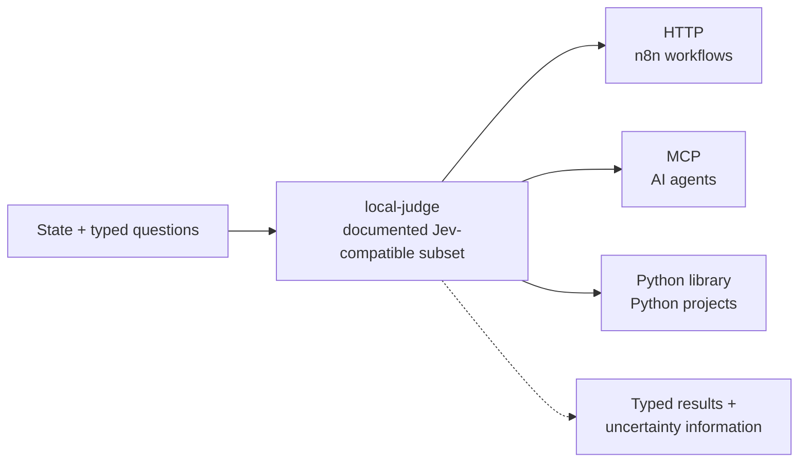

# local-judge

**A local decision engine implementing a documented Jev-compatible subset. Send state and typed questions; get back structured judgments and uncertainty information from your own models, on your own machine.**

Large decision models (like TypeSafe's Jev) showed that software doesn't need a text generator for filter / verification / triage steps — it needs fast, structured judgments. But their inference runs on someone else's servers, costs money per token, and works best in English.

`local-judge` implements a documented subset of the Jev request/response shape over local models (Ollama), while every byte stays on your machine and there are no hosted inference API charges.

**Status: project definition complete. Nothing is built yet.**

---

## The port, not the phone

The interface is the standard: shared state plus independent typed questions (`choice` / `score` / `noul`, each with instructions and criteria) → typed results with question-specific validity and uncertainty information. Questions are evaluated against the same state; criteria and relevant state determine the quality of the judgment. You don't design a power bank for one phone; you fit the standard port and any device works. Same here: consumers validate the port, they don't shape it.

## Design decisions

1. **Jev-compatible request/response subset** — `choice`, `score`, and `noul` retain their distinct semantics and documented validity rules. Field-level differences are explicit, never silently divergent, and the compatibility contract gets pinned by published fixtures.
2. **Question-specific validation in code, not prompting.** Menu enforcement applies to menu-based questions; score levels and Noul values have their own validity rules.
3. **Agreement, not calibrated confidence.** The native result exposes `agreement` — vote share across repeated samples — and never presents it as a calibrated probability. A Jev-compat adapter maps it onto the `confidence` field with a documented weaker guarantee, so a consumer cannot mistake one for the other.
4. **Three faces, one core**: HTTP for workflow tools (n8n), MCP for AI agents, importable library for Python projects.
5. **Fail closed**: invalid model output or inability to answer is reported, never converted into an invented valid-looking judgment; model server down → error, not a guess.
6. **Consumer-agnostic scope**: the project definition covers `noul`, `choice`, and `score`; stage-loop determines implementation order and acceptance evidence.

## Scope

**In:** the documented Jev-compatible evaluation endpoint, question-specific validation, sample-based agreement, the HTTP / MCP / library faces, and a spec test suite.

**Out, for now:** text generation, model training/fine-tuning, speed or calibration parity with hosted decision models, multi-tenancy, a hosted service.

## Not affiliated

local-judge is an independent implementation of a public request/response shape, for people who want judgments from local models. It is not affiliated with, endorsed by, or connected to TypeSafe AI.

## Licence

Not yet chosen.
