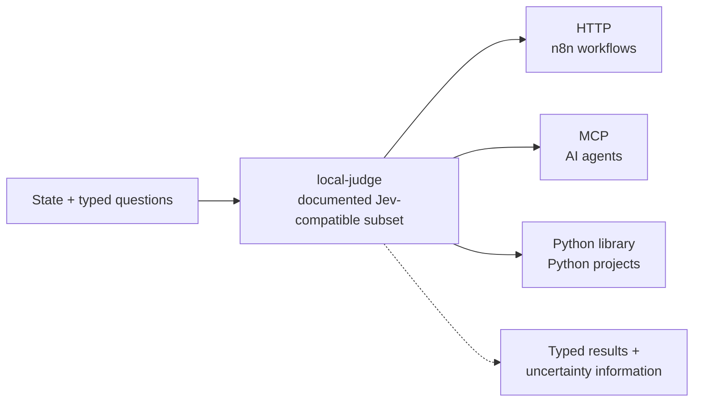

# local-judge

**A decision engine implementing a documented Jev-compatible subset. Send state and typed questions; get back structured judgments from a local model or an explicitly configured OpenAI-compatible endpoint.**

Large decision models (like TypeSafe's Jev) showed that software doesn't need a text generator for filter / verification / triage steps — it needs fast, structured judgments. But their inference runs on someone else's servers, costs money per token, and works best in English.

`local-judge` implements a documented subset of the Jev request/response shape. Ollama remains the local default; an OpenAI-compatible chat-completions adapter can connect to Open WebUI or another configured endpoint. Endpoint locality, data handling, and any inference charges depend on the service you choose.

**Status: the core, Ollama and OpenAI-compatible model adapters, and Python / HTTP / MCP faces are implemented. Scripted evidence-runner tests are present; representative live-model usefulness evidence has not yet been established.**

---

## The port, not the phone

The interface is the standard: shared state plus independent typed questions (`choice` / `score` / `noul`, each with instructions and criteria) → typed results with question-specific validity and uncertainty information. Questions are evaluated against the same state; criteria and relevant state determine the quality of the judgment. You don't design a power bank for one phone; you fit the standard port and any device works. Same here: consumers validate the port, they don't shape it.



## Design decisions

1. **Jev-compatible request/response subset** — `choice`, `score`, and `noul` retain their distinct semantics and documented validity rules. Field-level differences are explicit, never silently divergent, and the compatibility contract gets pinned by published fixtures.
2. **Question-specific validation in code, not prompting.** Menu enforcement applies to menu-based questions; score levels and Noul values have their own validity rules.
3. **Agreement, not calibrated confidence.** The native result exposes `agreement` — vote share across repeated samples — and never presents it as a calibrated probability. Noul's estimated probability that a statement is true is a separate value, not agreement or probability of answer correctness. A Jev-compat adapter may map agreement onto the `confidence` field, with the distinction disclosed in the compatibility contract.
4. **Three faces, one core**: HTTP for workflow tools (n8n), MCP for AI agents, importable library for Python projects.
5. **Fail closed**: invalid model output or inability to answer is reported, never converted into an invented valid-looking judgment; model endpoint down → error, not a guess.
6. **Consumer-agnostic scope**: the project definition covers `noul`, `choice`, and `score`; stage-loop determines implementation order and acceptance evidence.
7. **Explicit endpoint choice**: Ollama stays local and loopback-only. The OpenAI-compatible adapter sends requests to the configured endpoint; remote endpoints may receive judged data and charge for inference.

## Scope

**In:** the documented Jev-compatible evaluation contract, question-specific validation, sample-based agreement, Ollama and OpenAI-compatible model adapters, the HTTP / MCP / library faces, and a spec test suite.

**Out, for now:** text generation, model training/fine-tuning, speed or calibration parity with hosted decision models, multi-tenancy, a hosted service.

## Model endpoints

The OpenAI-compatible model port accepts a chat-completions API base URL. For
Open WebUI, use its API base URL and a key generated in **Settings → Account**.
When local-judge runs in a Docker container and Open WebUI publishes port 3040
on the host, `host.docker.internal` addresses that host from the container:

```python
import os

from local_judge import OpenAICompatibleModelPort, OpenAICompatibleProfile

model = os.environ["OPENWEBUI_MODEL"]  # exact model ID shown by Open WebUI
profile = OpenAICompatibleProfile(
    name=model,
    base_url="http://host.docker.internal:3040/api",
    api_key=os.environ["OPENWEBUI_API_KEY"],
)
model_port = OpenAICompatibleModelPort({model: profile})
```

For a process running directly on the host, use
`http://127.0.0.1:3040/api`. For another OpenAI-compatible service, set its
base URL (commonly ending in `/v1`) and the model ID it expects. The default
`json_schema` response format requires endpoint/model support; configure
`response_format="json_object"` when only JSON mode is supported. Local
validation remains authoritative. Remote endpoints receive the prompt and
state; locality and billing depend on the configured service.

## Not affiliated

local-judge is an independent implementation of a public request/response shape, for people who want judgments from local models. It is not affiliated with, endorsed by, or connected to TypeSafe AI.

## Licence

Not yet chosen.
