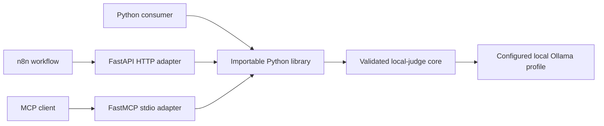

# Architecture

## Target Containers

FastAPI and FastMCP are thin, independently runnable access adapters. The
importable library is the only route to the core; adapters do not interpret
question types, aggregate samples, or create alternate trace behavior.

## Boundary Rules

- Native evaluation uses `POST /v1/evaluations`, MCP `local_judge_evaluate`,
  and the library `evaluate` function.
- Replay uses a self-contained inline result trace through `POST /v1/replays`,
  MCP `local_judge_replay`, and the library `replay` function. No server-side
  trace store or replay ID exists in v1.
- The Jev adapter is exposed on every face — `POST /v1/jev/evaluations`, MCP
  `local_judge_evaluate_jev`, and the library `evaluate_jev` function. It
  validates its closed three-field input with the native structural rules
  before conversion. It returns Jev-shaped `answers`
  plus the documented `local_judge` extension containing native traces.
- HTTP binds locally by default. v1 has no authentication, multi-tenancy, or
  persistent storage.
