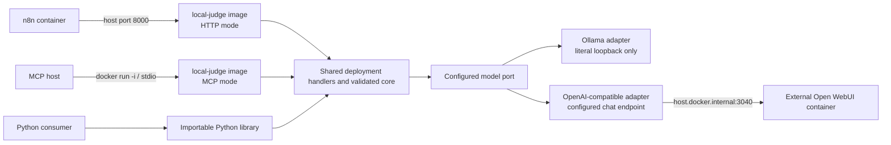

# Architecture

## Target Containers

```mermaid
flowchart LR
    N8N["n8n container"] -->|host port 8000| HTTP["local-judge image<br>HTTP mode"]
    AGENT["MCP host"] -->|docker run -i / stdio| MCP["local-judge image<br>MCP mode"]
    PY["Python consumer"] --> LIB["Importable Python library"]
    HTTP --> CORE["Shared deployment handlers and validated core"]
    MCP --> CORE
    LIB --> CORE
    CORE --> PORT["Configured model port"]
    PORT --> OLLAMA["Ollama adapter<br>literal loopback only"]
    PORT --> ENDPOINT["OpenAI-compatible adapter<br>configured chat endpoint"]
    ENDPOINT -->|host.docker.internal:3040| WEBUI["External Open WebUI container"]
```

FastAPI and FastMCP are thin, independently runnable access adapters. The
importable library is the only route to the core; access adapters do not
interpret question types, aggregate samples, or create alternate trace
behavior. The model port is injected into the shared orchestrator. Ollama
profiles remain loopback-only; the OpenAI-compatible adapter uses an
operator-configured endpoint such as Open WebUI's `/api/chat/completions`.
Endpoint configuration is deployment-owned and never comes from a request.
The Docker image's HTTP command composes handlers from environment settings;
its stdio command composes the same handlers for FastMCP. Compose uses the
default container network and a host-published Open WebUI port, not an external
network join. The HTTP host port is intentionally published on all interfaces;
it has no authentication and is intended only for the accepted local LAN
deployment.

Fresh evaluations use prompt artifact `prompt-2`; `prompt-1` remains packaged
for replay. The deployment forwards the resolved trace versions into each
typed executor as well as the trace builder, so an older replay sends the old
messages rather than merely carrying an old label. The prompt keeps engine
instructions separate from caller policy and serialized state evidence; the
`prompt-2` engine-owned answer-shape reminder follows the evidence message.

## Boundary Rules

- Native evaluation uses `POST /v1/evaluations`, MCP `local_judge_evaluate`,
  and the library `evaluate` function.
- Replay uses a self-contained inline result trace through `POST /v1/replays`,
  MCP `local_judge_replay`, and the library `replay` function. No server-side
  trace store or replay ID exists in v1.
- The Jev adapter is exposed on every face — `POST /v1/jev/evaluations`, MCP
  `local_judge_evaluate_jev`, and the library `evaluate_jev` function. It
  validates its closed three-field input with the native structural rules
  before conversion. It returns Jev-shaped `answers`
  plus the documented `local_judge` extension containing native traces.
- The Python `api.serve()` helper binds to loopback by default. The container
  entrypoint binds internally to `0.0.0.0:8000` and Compose publishes the host
  port on all interfaces as an explicit deployment choice. v1 has no HTTP
  authentication, multi-tenancy, or persistent storage.
- The endpoint adapter uses a configured base URL, optional bearer API key,
  non-streaming chat completions, and a bounded timeout. The endpoint may be
  local or remote; data locality and provider charges depend on that service.
