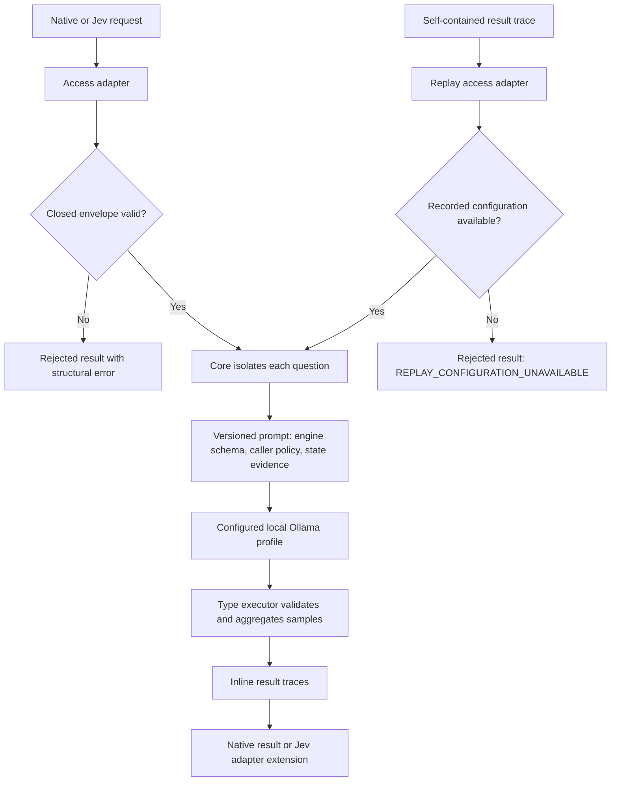

# System Flow

```mermaid
flowchart TD
    R["Native or Jev request"] --> A["Access adapter"]
    A --> V{"Closed envelope valid?"}
    V -- No --> RJ["Rejected result with structural error"]
    V -- Yes --> Q["Core isolates each question"]
    Q --> P["Versioned prompt: engine schema, caller policy, state evidence"]
    P --> O["Configured local Ollama profile"]
    O --> T["Type executor validates and aggregates samples"]
    T --> TR["Inline result traces"]
    TR --> N["Native result or Jev adapter extension"]
    X["Self-contained result trace"] --> RP["Replay access adapter"]
    RP --> C{"Recorded configuration available?"}
    C -- No --> RC["Rejected result: REPLAY_CONFIGURATION_UNAVAILABLE"]
    C -- Yes --> Q
```
