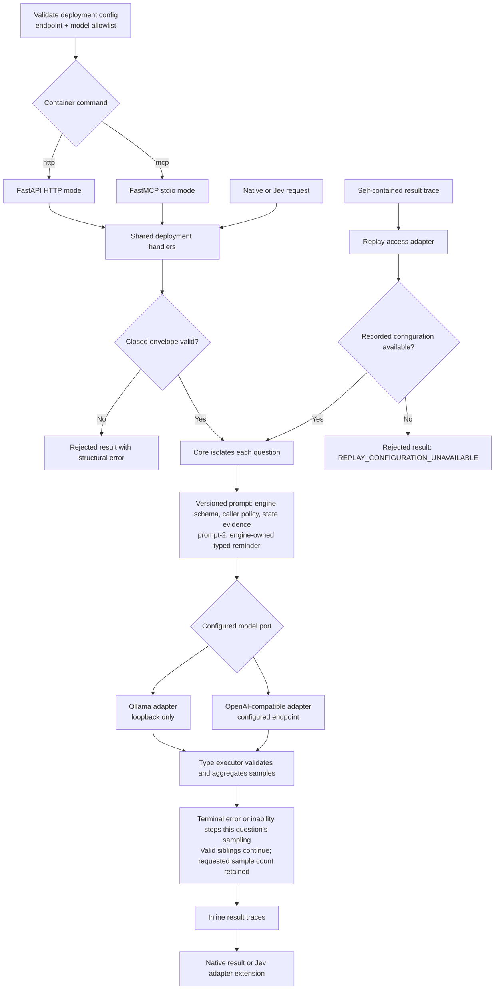

# System Flow

```mermaid
flowchart TD
    D{"Container command"} -->|http| H["FastAPI HTTP mode"]
    D -->|mcp| M["FastMCP stdio mode"]
    H --> A["Shared deployment handlers"]
    M --> A
    C0["Validate deployment config<br>endpoint + model allowlist"] --> D
    R["Native or Jev request"] --> A
    A --> V{"Closed envelope valid?"}
    V -- No --> RJ["Rejected result with structural error"]
    V -- Yes --> Q["Core isolates each question"]
    Q --> P["Versioned prompt: engine schema, caller policy, state evidence<br>prompt-2: engine-owned typed reminder"]
    P --> B{"Configured model port"}
    B --> O["Ollama adapter<br>loopback only"]
    B --> E["OpenAI-compatible adapter<br>configured endpoint"]
    O --> T["Type executor validates and aggregates samples"]
    E --> T
    T --> STOP["Terminal error or inability stops this question's sampling<br>Valid siblings continue; requested sample count retained"]
    STOP --> TR["Inline result traces"]
    TR --> N["Native result or Jev adapter extension"]
    X["Self-contained result trace"] --> RP["Replay access adapter"]
    RP --> C{"Recorded configuration available?"}
    C -- No --> RC["Rejected result: REPLAY_CONFIGURATION_UNAVAILABLE"]
    C -- Yes --> Q
```
